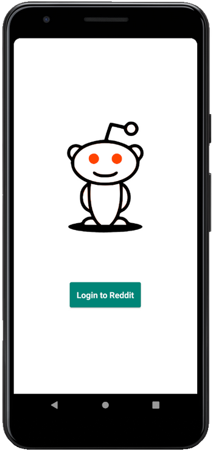
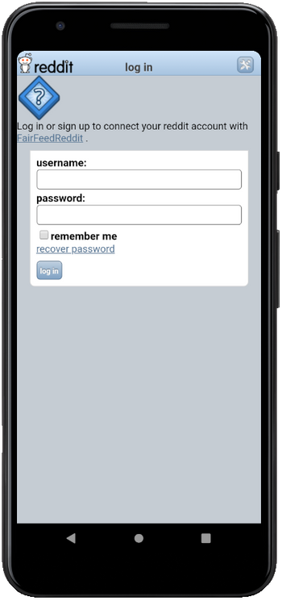
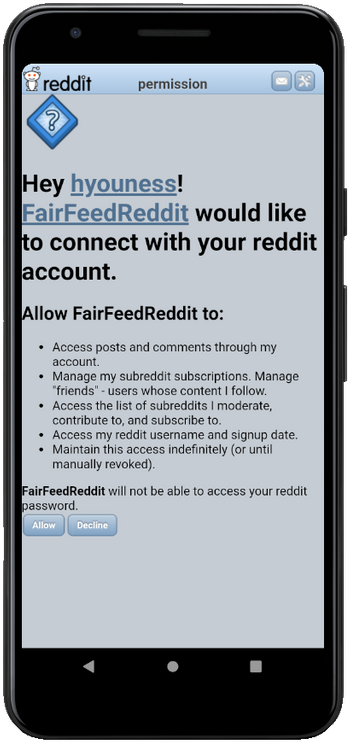
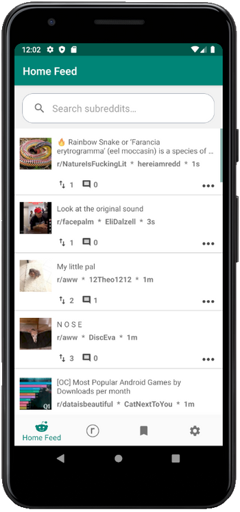
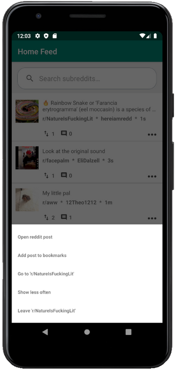
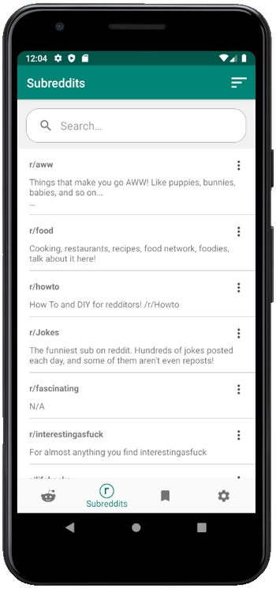
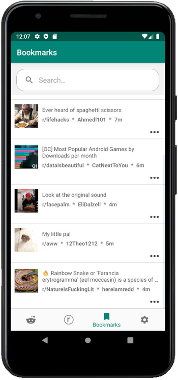
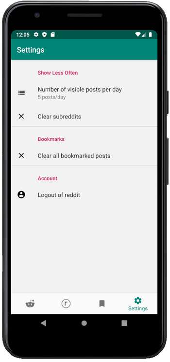
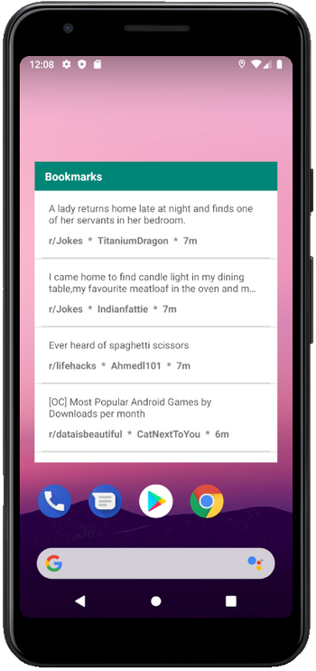

# Fair Feed Reddit

In Capstone Project of the Udacity Android Developer Nanodegree Program, **Fair Feed Reddit** was developed in order to help
Reddit users who subscribe to a large number of subreddits and wish to prevent the overflow of their feeds by posts from 1 or more subreddits.
  The app does so by providing a "show less often" feature for subreddits.

## Room for Improvement
- Create UI view for reddit post details
- Add Espresso &/or Instrumentation tests

## Screenshots
 
 
 

 
